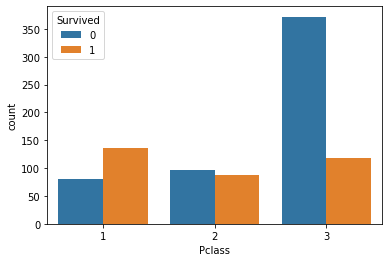

**复习：**回顾学习完第一章，我们对泰坦尼克号数据有了基本的了解，也学到了一些基本的统计方法，第二章中我们学习了数据的清理和重构，使得数据更加的易于理解；今天我们要学习的是第二章第三节：**数据可视化**，主要给大家介绍一下Python数据可视化库Matplotlib，在本章学习中，你也许会觉得数据很有趣。在打比赛的过程中，数据可视化可以让我们更好的看到每一个关键步骤的结果如何，可以用来优化方案，是一个很有用的技巧。

# 2 第二章：数据可视化

#### 开始之前，导入numpy、pandas以及matplotlib包和数据


```python
# 加载所需的库
import numpy as np
import pandas as pd
import matplotlib.pyplot as plt
# 如果出现 ModuleNotFoundError: No module named 'xxxx'
# 你只需要在终端/cmd下 pip install xxxx 即可

```


```python
#加载result.csv这个数据
# 导入result.csv这个文件,r'result.csv'表示里面的路径就是原生路径，不需要转义字符了。
text = pd.read_csv(r"result.csv")
text
```


<div>
<style scoped>
    .dataframe tbody tr th:only-of-type {
        vertical-align: middle;
    }

    .dataframe tbody tr th {
        vertical-align: top;
    }

    .dataframe thead th {
        text-align: right;
    }
</style>
<table border="1" class="dataframe">
  <thead>
    <tr style="text-align: right;">
      <th></th>
      <th>Unnamed: 0</th>
      <th>PassengerId</th>
      <th>Survived</th>
      <th>Pclass</th>
      <th>Name</th>
      <th>Sex</th>
      <th>Age</th>
      <th>SibSp</th>
      <th>Parch</th>
      <th>Ticket</th>
      <th>Fare</th>
      <th>Cabin</th>
      <th>Embarked</th>
    </tr>
  </thead>
  <tbody>
    <tr>
      <th>0</th>
      <td>0</td>
      <td>1</td>
      <td>0</td>
      <td>3</td>
      <td>Braund, Mr. Owen Harris</td>
      <td>male</td>
      <td>22.0</td>
      <td>1</td>
      <td>0</td>
      <td>A/5 21171</td>
      <td>7.2500</td>
      <td>NaN</td>
      <td>S</td>
    </tr>
    <tr>
      <th>1</th>
      <td>1</td>
      <td>2</td>
      <td>1</td>
      <td>1</td>
      <td>Cumings, Mrs. John Bradley (Florence Briggs Th...</td>
      <td>female</td>
      <td>38.0</td>
      <td>1</td>
      <td>0</td>
      <td>PC 17599</td>
      <td>71.2833</td>
      <td>C85</td>
      <td>C</td>
    </tr>
    <tr>
      <th>2</th>
      <td>2</td>
      <td>3</td>
      <td>1</td>
      <td>3</td>
      <td>Heikkinen, Miss. Laina</td>
      <td>female</td>
      <td>26.0</td>
      <td>0</td>
      <td>0</td>
      <td>STON/O2. 3101282</td>
      <td>7.9250</td>
      <td>NaN</td>
      <td>S</td>
    </tr>
    <tr>
      <th>3</th>
      <td>3</td>
      <td>4</td>
      <td>1</td>
      <td>1</td>
      <td>Futrelle, Mrs. Jacques Heath (Lily May Peel)</td>
      <td>female</td>
      <td>35.0</td>
      <td>1</td>
      <td>0</td>
      <td>113803</td>
      <td>53.1000</td>
      <td>C123</td>
      <td>S</td>
    </tr>
    <tr>
      <th>4</th>
      <td>4</td>
      <td>5</td>
      <td>0</td>
      <td>3</td>
      <td>Allen, Mr. William Henry</td>
      <td>male</td>
      <td>35.0</td>
      <td>0</td>
      <td>0</td>
      <td>373450</td>
      <td>8.0500</td>
      <td>NaN</td>
      <td>S</td>
    </tr>
    <tr>
      <th>...</th>
      <td>...</td>
      <td>...</td>
      <td>...</td>
      <td>...</td>
      <td>...</td>
      <td>...</td>
      <td>...</td>
      <td>...</td>
      <td>...</td>
      <td>...</td>
      <td>...</td>
      <td>...</td>
      <td>...</td>
    </tr>
    <tr>
      <th>886</th>
      <td>447</td>
      <td>887</td>
      <td>0</td>
      <td>2</td>
      <td>Montvila, Rev. Juozas</td>
      <td>male</td>
      <td>27.0</td>
      <td>0</td>
      <td>0</td>
      <td>211536</td>
      <td>13.0000</td>
      <td>NaN</td>
      <td>S</td>
    </tr>
    <tr>
      <th>887</th>
      <td>448</td>
      <td>888</td>
      <td>1</td>
      <td>1</td>
      <td>Graham, Miss. Margaret Edith</td>
      <td>female</td>
      <td>19.0</td>
      <td>0</td>
      <td>0</td>
      <td>112053</td>
      <td>30.0000</td>
      <td>B42</td>
      <td>S</td>
    </tr>
    <tr>
      <th>888</th>
      <td>449</td>
      <td>889</td>
      <td>0</td>
      <td>3</td>
      <td>Johnston, Miss. Catherine Helen "Carrie"</td>
      <td>female</td>
      <td>NaN</td>
      <td>1</td>
      <td>2</td>
      <td>W./C. 6607</td>
      <td>23.4500</td>
      <td>NaN</td>
      <td>S</td>
    </tr>
    <tr>
      <th>889</th>
      <td>450</td>
      <td>890</td>
      <td>1</td>
      <td>1</td>
      <td>Behr, Mr. Karl Howell</td>
      <td>male</td>
      <td>26.0</td>
      <td>0</td>
      <td>0</td>
      <td>111369</td>
      <td>30.0000</td>
      <td>C148</td>
      <td>C</td>
    </tr>
    <tr>
      <th>890</th>
      <td>451</td>
      <td>891</td>
      <td>0</td>
      <td>3</td>
      <td>Dooley, Mr. Patrick</td>
      <td>male</td>
      <td>32.0</td>
      <td>0</td>
      <td>0</td>
      <td>370376</td>
      <td>7.7500</td>
      <td>NaN</td>
      <td>Q</td>
    </tr>
  </tbody>
</table>
<p>891 rows × 13 columns</p>
</div>


### 2.7 如何让人一眼看懂你的数据？
《Python for Data Analysis》第九章

#### 2.7.1 任务一：跟着书本第九章，了解matplotlib，自己创建一个数据项，对其进行基本可视化

Matplotlib 可能是 Python 2D-绘图领域使用最广泛的套件。它能让使用者很轻松地将数据图形化，并且提供多样化的输出格式.


【思考】最基本的可视化图案有哪些？分别适用于那些场景？（比如折线图适合可视化某个属性值随时间变化的走势）

#思考回答
#这一部分需要了解可视化图案的的逻辑，知道什么样的图案可以表达什么样的信号
- 散点图 <---->离散数据
- 折线图 <---->连续数据，时序数据
- 柱状图/条形图<---->多分类
- 饼图<---->占比
- 热力图<---->地理数据
- 箱型图/大提琴图<---->数据分散情况


```python
# 死亡和生存的占比
text.groupby('Survived').count()['PassengerId'].plot.pie()
```


    <AxesSubplot:ylabel='PassengerId'>


    

    


#### 2.7.2 任务二：可视化展示泰坦尼克号数据集中男女中生存人数分布情况（用柱状图试试）。


```python
#代码编写
sex = text.groupby('Sex')
```


    <pandas.core.groupby.generic.DataFrameGroupBy object at 0x000001B020121CD0>


```python
sexbySurvived=sex['Survived'].sum()
sexbySurvived
```


    Sex
    female    233
    male      109
    Name: Survived, dtype: int64


```python
sexbySurvived.plot.bar()
```


    <AxesSubplot:xlabel='Sex'>


    

    


【思考】计算出泰坦尼克号数据集中男女中死亡人数，并可视化展示？如何和男女生存人数可视化柱状图结合到一起？看到你的数据可视化，说说你的第一感受（比如：你一眼看出男生存活人数更多，那么性别可能会影响存活率）。

#### 2.7.3 任务三：可视化展示泰坦尼克号数据集中男女中生存人与死亡人数的比例图（用柱状图试试）。


```python
#思考题回答
sexbyDeath=sex['Survived'].count()-sex['Survived'].sum()
sexbyDeath
```


    Sex
    female     81
    male      468
    Name: Survived, dtype: int64


```python
sexbyDeath.plot.bar()
plt.title('death_count')
```


    Text(0.5, 1.0, 'death_count')


    

    


```python
#1.stack：  将数据的列索引转换为行索引(列索引可以简单理解为列名)
#2.unstack：将数据的行索引转换为列索引
text.groupby(['Sex','Survived'])['Survived'].count().plot.bar()
text.groupby(['Sex','Survived'])['Survived'].count()
```


    Sex     Survived
    female  0            81
            1           233
    male    0           468
            1           109
    Name: Survived, dtype: int64


    

    


```python
#默认为横向
text.groupby(['Sex','Survived'])['Survived'].count().unstack().plot.bar()
text.groupby(['Sex','Survived'])['Survived'].count().unstack()
```


<div>
<style scoped>
    .dataframe tbody tr th:only-of-type {
        vertical-align: middle;
    }

    .dataframe tbody tr th {
        vertical-align: top;
    }

    .dataframe thead th {
        text-align: right;
    }
</style>
<table border="1" class="dataframe">
  <thead>
    <tr style="text-align: right;">
      <th>Survived</th>
      <th>0</th>
      <th>1</th>
    </tr>
    <tr>
      <th>Sex</th>
      <th></th>
      <th></th>
    </tr>
  </thead>
  <tbody>
    <tr>
      <th>female</th>
      <td>81</td>
      <td>233</td>
    </tr>
    <tr>
      <th>male</th>
      <td>468</td>
      <td>109</td>
    </tr>
  </tbody>
</table>
</div>


    

    


```python
# stacked属性为True可以设置为堆积柱状图
text.groupby(['Sex','Survived'])['Survived'].count().unstack().plot(kind='bar',stacked='True')
```


    <AxesSubplot:xlabel='Sex'>


    

    


【提示】男女这两个数据轴，存活和死亡人数按比例用柱状图表示

#### 2.7.4 任务四：可视化展示泰坦尼克号数据集中不同票价的人生存和死亡人数分布情况。（用折线图试试）（横轴是不同票价，纵轴是存活人数）

【提示】对于这种统计性质的且用折线表示的数据，你可以考虑将数据排序或者不排序来分别表示。看看你能发现什么？


```python
#代码编写
# 计算不同票价中生存与死亡人数 1表示生存，0表示死亡
# value_counts():默认显示数字形式，默认排序，默认降序排序，默认删除na；
# value_counts():查看表格某列中有多少个不同值的快捷方法，并计算每个不同值有在该列中有多少重复值
text.groupby(['Fare'])['Survived'].value_counts(ascending=True)
```


    Fare      Survived
    0.0000    1            1
              0           14
    4.0125    0            1
    5.0000    0            1
    6.2375    0            1
                          ..
    247.5208  1            1
    262.3750  1            2
    263.0000  0            2
              1            2
    512.3292  1            3
    Name: Survived, Length: 330, dtype: int64


```python
text.groupby(['Fare'])['Survived'].value_counts(ascending=False)
```


    Fare      Survived
    0.0000    0           14
              1            1
    4.0125    0            1
    5.0000    0            1
    6.2375    0            1
                          ..
    247.5208  1            1
    262.3750  1            2
    263.0000  0            2
              1            2
    512.3292  1            3
    Name: Survived, Length: 330, dtype: int64


【疑问】为什么并没有按照降序的方式排序？
这个和groupby(['Fare','Survived'])['Survived']排序有何不同？


```python
print(text.groupby(['Fare','Survived'])['Survived'].count())
print(text.groupby(['Fare'])['Survived'].value_counts())
```

    Fare      Survived
    0.0000    0           14
              1            1
    4.0125    0            1
    5.0000    0            1
    6.2375    0            1
                          ..
    247.5208  1            1
    262.3750  1            2
    263.0000  0            2
              1            2
    512.3292  1            3
    Name: Survived, Length: 330, dtype: int64
    Fare      Survived
    0.0000    0           14
              1            1
    4.0125    0            1
    5.0000    0            1
    6.2375    0            1
                          ..
    247.5208  1            1
    262.3750  1            2
    263.0000  0            2
              1            2
    512.3292  1            3
    Name: Survived, Length: 330, dtype: int64
    


```python
 text.groupby(['Fare'])['Survived'].value_counts().sort_values(ascending=False)
```


    Fare     Survived
    8.0500   0           38
    7.8958   0           37
    13.0000  0           26
    7.7500   0           22
    13.0000  1           16
                         ..
    7.7417   0            1
    26.2833  1            1
    7.7375   1            1
    26.3875  1            1
    22.5250  0            1
    Name: Survived, Length: 330, dtype: int64


```python
plt.figure(figsize=(20,18))
text.groupby(['Fare'])['Survived'].value_counts().sort_values(ascending=False).plot(grid=True)
```


    <AxesSubplot:xlabel='Fare,Survived'>


    

    


#### 2.7.5 任务五：可视化展示泰坦尼克号数据集中不同仓位等级的人生存和死亡人员的分布情况。（用柱状图试试）


```python
#代码编写
# 1表示生存，0表示死亡
textbyPclass=text.groupby(['Pclass'])['Survived'].value_counts()
print(type(textbyPclass))
textbyPclass
```

    <class 'pandas.core.series.Series'>
    


    Pclass  Survived
    1       1           136
            0            80
    2       0            97
            1            87
    3       0           372
            1           119
    Name: Survived, dtype: int64


```python
textbyPclassAndUnstack=text.groupby(['Pclass'])['Survived'].value_counts().unstack()
print(type(textbyPclassAndUnstack))
textbyPclassAndUnstack
```

    <class 'pandas.core.frame.DataFrame'>
    


<div>
<style scoped>
    .dataframe tbody tr th:only-of-type {
        vertical-align: middle;
    }

    .dataframe tbody tr th {
        vertical-align: top;
    }

    .dataframe thead th {
        text-align: right;
    }
</style>
<table border="1" class="dataframe">
  <thead>
    <tr style="text-align: right;">
      <th>Survived</th>
      <th>0</th>
      <th>1</th>
    </tr>
    <tr>
      <th>Pclass</th>
      <th></th>
      <th></th>
    </tr>
  </thead>
  <tbody>
    <tr>
      <th>1</th>
      <td>80</td>
      <td>136</td>
    </tr>
    <tr>
      <th>2</th>
      <td>97</td>
      <td>87</td>
    </tr>
    <tr>
      <th>3</th>
      <td>372</td>
      <td>119</td>
    </tr>
  </tbody>
</table>
</div>


可以看出，unstack()将series数据转成了dataFrame


```python
text.groupby(['Pclass'])['Survived'].value_counts().plot.bar()
text.groupby(['Pclass'])['Survived'].value_counts().unstack().plot.bar()
```


    <AxesSubplot:xlabel='Pclass'>


    

    


    

    


```python
#使用seaborn
import seaborn as sns
sns.countplot(x="Pclass", hue="Survived", data=text)
```


    <AxesSubplot:xlabel='Pclass', ylabel='count'>


    

    


【思考】看到这个前面几个数据可视化，说说你的第一感受和你的总结

思考题回答:

- 使用seaborn更方便了，也不需要先拿到这一列的数据保存
- seaborn官方文档见链接：http://seaborn.pydata.org/api.html
- countplot是seaborn库中分类图的一种，作用是使用条形显示每个分箱器中的观察计数

#### 2.7.6 任务六：可视化展示泰坦尼克号数据集中不同年龄的人生存与死亡人数分布情况。(不限表达方式)


```python
#条形图
plt.figure(figsize=(20,18))
sns.countplot(x="Age", hue="Survived", data=text)
```


    <AxesSubplot:xlabel='Age', ylabel='count'>


    

    


```python
#分开折线图
text.groupby(['Age'])['Survived'].value_counts().unstack().plot.line()
```


    <AxesSubplot:xlabel='Age'>


    

    


```python
# 排序后的线型图
plt.figure(figsize=(20,18))
text.groupby(['Age'])['Survived'].value_counts().sort_values(ascending=False).plot(grid=True)
```


    <AxesSubplot:xlabel='Age,Survived'>


    

    


```python

```


```python
#seaborn FacetGrid用于绘制条件关系的多图网格
facet = sns.FacetGrid(text, hue="Survived",aspect=3)
print(facet)
#kdeplot使用核密度估计绘制单变量或双变量分布
facet.map(sns.kdeplot,'Age',shade= True)
#设置x轴范围
facet.set(xlim=(0, text['Age'].max()))
facet.add_legend()
```

    <seaborn.axisgrid.FacetGrid object at 0x000001B02B4D1970>
    


    <seaborn.axisgrid.FacetGrid at 0x1b02b4d1970>


    

    


#### 2.7.7 任务七：可视化展示泰坦尼克号数据集中不同仓位等级的人年龄分布情况。（用折线图试试）


```python
#代码编写
facet1 = sns.FacetGrid(text, hue="Pclass",aspect=3)
print(facet)
facet1.map(sns.kdeplot,'Age',shade= True)
facet1.set(xlim=(0, text['Age'].max()))
facet1.add_legend()
```

    <seaborn.axisgrid.FacetGrid object at 0x000001B02B4D1970>
    


    <seaborn.axisgrid.FacetGrid at 0x1b02c8983d0>


    

    


【思考】上面所有可视化的例子做一个总体的分析，你看看你能不能有自己发现

 思考题回答
1. 一等仓年龄集中在40岁左右，二等舱年龄集中在30岁左右，三等舱年龄集中在20岁左右
2. 三等舱死亡人数最多。
3. 男生死亡比例多于女生
4. 全部总人数中，死亡人数多于存活人数

【总结】到这里，我们的可视化就告一段落啦，如果你对数据可视化极其感兴趣，你还可以了解一下其他可视化模块，如：**pyecharts**，bokeh等。

如果你在工作中使用数据可视化，你必须知道数据可视化最大的作用不是炫酷，而是最快最直观的理解数据要表达什么，你觉得呢？
