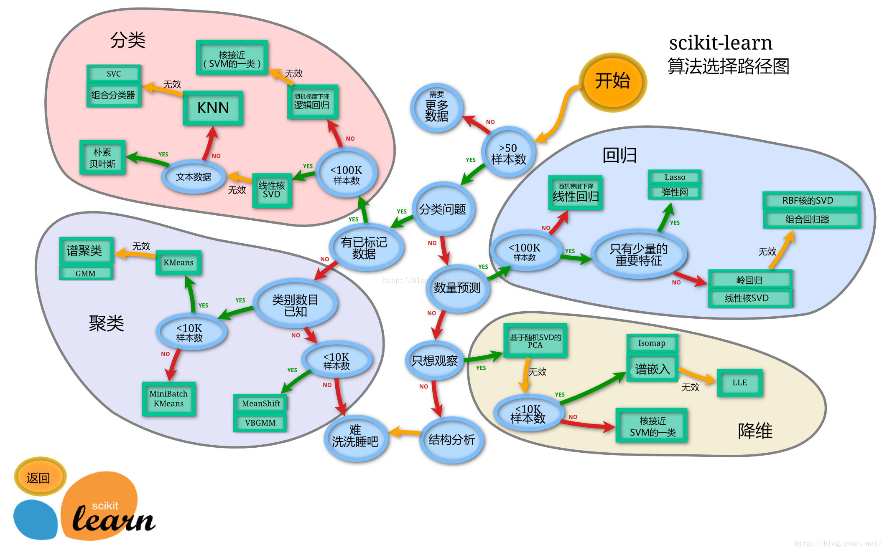

## 第三章 模型搭建和评估--建模

经过前面的两章的知识点的学习，我可以对数数据的本身进行处理，比如数据本身的增删查补，还可以做必要的清洗工作。那么下面我们就要开始使用我们前面处理好的数据了。这一章我们要做的就是使用数据，我们做数据分析的目的也就是，运用我们的数据以及结合我的业务来得到某些我们需要知道的结果。那么分析的第一步就是建模，搭建一个预测模型或者其他模型；我们从这个模型的到结果之后，我们要分析我的模型是不是足够的可靠，那我就需要评估这个模型。今天我们学习建模，下一节我们学习评估。

我们拥有的泰坦尼克号的数据集，那么我们这次的目的就是，完成泰坦尼克号存活预测这个任务。


```python
import pandas as pd
import numpy as np
import matplotlib.pyplot as plt
import seaborn as sns
from IPython.display import Image
```


```python
%matplotlib inline
```


```python
plt.rcParams['font.sans-serif'] = ['SimHei']  # 用来正常显示中文标签
plt.rcParams['axes.unicode_minus'] = False  # 用来正常显示负号
plt.rcParams['figure.figsize'] = (10, 6)  # 设置输出图片大小
```

载入这些库，如果缺少某些库，请安装他们

【思考】这些库的作用是什么呢？你需要查一查

【思考题回答】

pandas 是一个用于数据分析的python库

numpy是为运算提供大量数学函数的python库

matplotlib.pyplot是 Matplotlib 的子库，提供了和 MATLAB 类似的绘图 API

seaborn是基于matplotlib的图形可视化python包

IPython 是一个 python 的交互式 shell


```python
%matplotlib inline
```

 **载入我们提供清洗之后的数据(clear_data.csv)，大家也将原始数据载入（train.csv），说说他们有什么不同**


```python
#原数据
train = pd.read_csv("train.csv")
train.head()

```


<div>
<style scoped>
    .dataframe tbody tr th:only-of-type {
        vertical-align: middle;
    }

    .dataframe tbody tr th {
        vertical-align: top;
    }

    .dataframe thead th {
        text-align: right;
    }
</style>
<table border="1" class="dataframe">
  <thead>
    <tr style="text-align: right;">
      <th></th>
      <th>PassengerId</th>
      <th>Survived</th>
      <th>Pclass</th>
      <th>Name</th>
      <th>Sex</th>
      <th>Age</th>
      <th>SibSp</th>
      <th>Parch</th>
      <th>Ticket</th>
      <th>Fare</th>
      <th>Cabin</th>
      <th>Embarked</th>
    </tr>
  </thead>
  <tbody>
    <tr>
      <th>0</th>
      <td>1</td>
      <td>0</td>
      <td>3</td>
      <td>Braund, Mr. Owen Harris</td>
      <td>male</td>
      <td>22.0</td>
      <td>1</td>
      <td>0</td>
      <td>A/5 21171</td>
      <td>7.2500</td>
      <td>NaN</td>
      <td>S</td>
    </tr>
    <tr>
      <th>1</th>
      <td>2</td>
      <td>1</td>
      <td>1</td>
      <td>Cumings, Mrs. John Bradley (Florence Briggs Th...</td>
      <td>female</td>
      <td>38.0</td>
      <td>1</td>
      <td>0</td>
      <td>PC 17599</td>
      <td>71.2833</td>
      <td>C85</td>
      <td>C</td>
    </tr>
    <tr>
      <th>2</th>
      <td>3</td>
      <td>1</td>
      <td>3</td>
      <td>Heikkinen, Miss. Laina</td>
      <td>female</td>
      <td>26.0</td>
      <td>0</td>
      <td>0</td>
      <td>STON/O2. 3101282</td>
      <td>7.9250</td>
      <td>NaN</td>
      <td>S</td>
    </tr>
    <tr>
      <th>3</th>
      <td>4</td>
      <td>1</td>
      <td>1</td>
      <td>Futrelle, Mrs. Jacques Heath (Lily May Peel)</td>
      <td>female</td>
      <td>35.0</td>
      <td>1</td>
      <td>0</td>
      <td>113803</td>
      <td>53.1000</td>
      <td>C123</td>
      <td>S</td>
    </tr>
    <tr>
      <th>4</th>
      <td>5</td>
      <td>0</td>
      <td>3</td>
      <td>Allen, Mr. William Henry</td>
      <td>male</td>
      <td>35.0</td>
      <td>0</td>
      <td>0</td>
      <td>373450</td>
      <td>8.0500</td>
      <td>NaN</td>
      <td>S</td>
    </tr>
  </tbody>
</table>
</div>


```python
#清洗过后的数据
data=pd.read_csv("clear_data.csv")
data.head()
```


<div>
<style scoped>
    .dataframe tbody tr th:only-of-type {
        vertical-align: middle;
    }

    .dataframe tbody tr th {
        vertical-align: top;
    }

    .dataframe thead th {
        text-align: right;
    }
</style>
<table border="1" class="dataframe">
  <thead>
    <tr style="text-align: right;">
      <th></th>
      <th>PassengerId</th>
      <th>Pclass</th>
      <th>Age</th>
      <th>SibSp</th>
      <th>Parch</th>
      <th>Fare</th>
      <th>Sex_female</th>
      <th>Sex_male</th>
      <th>Embarked_C</th>
      <th>Embarked_Q</th>
      <th>Embarked_S</th>
    </tr>
  </thead>
  <tbody>
    <tr>
      <th>0</th>
      <td>0</td>
      <td>3</td>
      <td>22.0</td>
      <td>1</td>
      <td>0</td>
      <td>7.2500</td>
      <td>0</td>
      <td>1</td>
      <td>0</td>
      <td>0</td>
      <td>1</td>
    </tr>
    <tr>
      <th>1</th>
      <td>1</td>
      <td>1</td>
      <td>38.0</td>
      <td>1</td>
      <td>0</td>
      <td>71.2833</td>
      <td>1</td>
      <td>0</td>
      <td>1</td>
      <td>0</td>
      <td>0</td>
    </tr>
    <tr>
      <th>2</th>
      <td>2</td>
      <td>3</td>
      <td>26.0</td>
      <td>0</td>
      <td>0</td>
      <td>7.9250</td>
      <td>1</td>
      <td>0</td>
      <td>0</td>
      <td>0</td>
      <td>1</td>
    </tr>
    <tr>
      <th>3</th>
      <td>3</td>
      <td>1</td>
      <td>35.0</td>
      <td>1</td>
      <td>0</td>
      <td>53.1000</td>
      <td>1</td>
      <td>0</td>
      <td>0</td>
      <td>0</td>
      <td>1</td>
    </tr>
    <tr>
      <th>4</th>
      <td>4</td>
      <td>3</td>
      <td>35.0</td>
      <td>0</td>
      <td>0</td>
      <td>8.0500</td>
      <td>0</td>
      <td>1</td>
      <td>0</td>
      <td>0</td>
      <td>1</td>
    </tr>
  </tbody>
</table>
</div>


### 模型搭建

* 处理完前面的数据我们就得到建模数据，下一步是选择合适模型
* 在进行模型选择之前我们需要先知道数据集最终是进行**监督学习**还是**无监督学习**
* 模型的选择一方面是通过我们的任务来决定的。
* 除了根据我们任务来选择模型外，还可以根据数据样本量以及特征的稀疏性来决定
* 刚开始我们总是先尝试使用一个基本的模型来作为其baseline，进而再训练其他模型做对比，最终选择泛化能力或性能比较好的模型

这里我的建模，并不是从零开始，自己一个人完成完成所有代码的编译。我们这里使用一个机器学习最常用的一个库（sklearn）来完成我们的模型的搭建

**下面给出sklearn的算法选择路径，供大家参考**


```python
# sklearn模型算法选择路径图
Image('sklearn.png')
```


    

    


【思考】数据集哪些差异会导致模型在拟合数据时发生变化

【思考回答】

1. 数据量
2. 有无标记
3. 数据类别是否已知
4. 数据类型是不是文本数据
5. 数据特征选择


#### 任务一：切割训练集和测试集
这里使用留出法划分数据集

* 将数据集分为自变量和因变量
* 按比例切割训练集和测试集(一般测试集的比例有30%、25%、20%、15%和10%)
* 使用分层抽样
* 设置随机种子以便结果能复现

【思考】
* 划分数据集的方法有哪些？
* 为什么使用分层抽样，这样的好处有什么？

#### 任务提示1
* 切割数据集是为了后续能评估模型泛化能力
* sklearn中切割数据集的方法为`train_test_split`
* 查看函数文档可以在jupyter noteboo里面使用`train_test_split?`后回车即可看到
* 分层和随机种子在参数里寻找

要从clear_data.csv和train.csv中提取train_test_split()所需的参数


```python
#写入代码
from sklearn.model_selection import train_test_split
# 一般先取出X和y后再切割，有些情况会使用到未切割的，这时候X和y就可以用
# x是清洗好的数据，y是我们要预测的存活数据'Survived'
X = data
y = train['Survived']
```


```python
# 对数据集进行切割，random_state：控制随机数种子，默认为None，即纯随机（伪随机）；设置为0，不随机
X_train, X_test, y_train, y_test = train_test_split(X, y, stratify=y, random_state=0)
```


```python
# 查看数据形状,默认切割比例是3：1
X_train.shape, X_test.shape
```


    ((668, 11), (223, 11))


【思考】
* 什么情况下切割数据集的时候不用进行随机选取

【思考回答】

若验证集样本数量过于小，进而导致无论训练出的模型效果如何，都无法在验证集上取得真实的评估结果，从而降低了评估效果的保真性（fidelity）。

因此训练集与验证集间的比例就不能过于随便，通常情况下我们将2/3到4/5的样本划分出来用于训练；

#### 任务二：模型创建
* 创建基于线性模型的分类模型（逻辑回归）
* 创建基于树的分类模型（决策树、随机森林）
* 分别使用这些模型进行训练，分别的到训练集和测试集的得分
* 查看模型的参数，并更改参数值，观察模型变化

#### 提示
* 逻辑回归不是回归模型而是分类模型，不要与`LinearRegression`混淆
* 随机森林其实是决策树集成为了降低决策树过拟合的情况
* 线性模型所在的模块为`sklearn.linear_model`
* 树模型所在的模块为`sklearn.ensemble`


```python
#引入模块,树模型>随机森林分类 线性模型>线性回归
from sklearn.linear_model import LogisticRegression
from sklearn.ensemble import RandomForestClassifier
```


```python
#建立线性回归模型
model = LogisticRegression()
```


```python
#在训练集上进行训练
model.fit(X_train,y_train)
```

    C:\ProgramData\Anaconda3\lib\site-packages\sklearn\linear_model\_logistic.py:763: ConvergenceWarning: lbfgs failed to converge (status=1):
    STOP: TOTAL NO. of ITERATIONS REACHED LIMIT.
    
    Increase the number of iterations (max_iter) or scale the data as shown in:
        https://scikit-learn.org/stable/modules/preprocessing.html
    Please also refer to the documentation for alternative solver options:
        https://scikit-learn.org/stable/modules/linear_model.html#logistic-regression
      n_iter_i = _check_optimize_result(
    


    LogisticRegression()


```python
#进行预测
pred = model.predict(X_train)
pred
```


    array([0, 1, 1, 1, 0, 0, 1, 0, 1, 1, 0, 0, 0, 1, 0, 0, 1, 1, 0, 0, 0, 1,
           1, 0, 0, 0, 0, 0, 0, 0, 0, 1, 1, 0, 0, 1, 0, 0, 0, 1, 0, 0, 0, 0,
           1, 0, 0, 0, 1, 1, 0, 0, 0, 1, 0, 0, 1, 0, 1, 0, 0, 0, 0, 0, 0, 1,
           0, 0, 0, 0, 1, 0, 0, 1, 0, 0, 1, 0, 0, 0, 0, 0, 0, 0, 0, 1, 0, 0,
           0, 0, 0, 0, 0, 0, 0, 1, 0, 1, 0, 0, 1, 1, 1, 0, 0, 0, 1, 0, 0, 0,
           0, 1, 0, 0, 0, 0, 1, 1, 0, 0, 0, 0, 1, 0, 0, 0, 1, 0, 1, 1, 1, 0,
           1, 1, 1, 0, 0, 1, 1, 0, 1, 1, 1, 1, 0, 0, 0, 0, 0, 1, 1, 1, 0, 0,
           0, 0, 0, 0, 0, 0, 0, 0, 0, 1, 1, 0, 0, 0, 1, 0, 1, 0, 0, 1, 1, 1,
           0, 0, 1, 0, 0, 0, 0, 1, 0, 0, 1, 0, 0, 0, 0, 0, 0, 0, 0, 1, 1, 1,
           0, 0, 0, 1, 0, 0, 1, 1, 0, 0, 1, 0, 0, 0, 0, 0, 1, 0, 1, 1, 0, 0,
           0, 1, 0, 0, 0, 0, 0, 1, 0, 0, 1, 0, 0, 1, 0, 1, 1, 0, 0, 1, 0, 1,
           0, 0, 0, 0, 1, 0, 0, 0, 0, 0, 1, 1, 1, 0, 1, 0, 0, 0, 0, 0, 0, 0,
           1, 0, 1, 0, 1, 0, 1, 0, 0, 1, 1, 1, 0, 0, 0, 1, 0, 1, 1, 1, 0, 1,
           0, 1, 0, 1, 1, 0, 0, 1, 0, 0, 0, 0, 0, 0, 0, 0, 0, 0, 0, 0, 1, 1,
           0, 1, 1, 0, 1, 0, 1, 0, 1, 0, 1, 0, 1, 0, 0, 0, 1, 0, 1, 0, 1, 0,
           0, 0, 0, 1, 0, 0, 0, 0, 0, 0, 0, 0, 0, 0, 0, 0, 1, 0, 0, 0, 0, 1,
           0, 0, 1, 1, 0, 0, 0, 1, 1, 0, 0, 0, 0, 0, 1, 1, 0, 1, 0, 0, 0, 1,
           1, 0, 0, 1, 1, 1, 1, 1, 0, 1, 0, 0, 0, 0, 0, 0, 0, 0, 1, 0, 0, 1,
           0, 0, 0, 1, 0, 1, 0, 0, 1, 0, 0, 1, 1, 1, 1, 1, 0, 0, 0, 1, 1, 0,
           0, 1, 0, 0, 0, 0, 0, 1, 1, 1, 1, 1, 1, 1, 0, 0, 1, 0, 0, 1, 0, 0,
           1, 0, 0, 0, 0, 0, 0, 1, 0, 1, 1, 0, 1, 1, 0, 1, 1, 0, 0, 0, 1, 1,
           1, 1, 0, 1, 0, 1, 1, 0, 1, 1, 0, 1, 0, 1, 0, 1, 1, 0, 0, 0, 1, 0,
           0, 1, 0, 0, 0, 0, 1, 1, 0, 0, 1, 0, 1, 0, 1, 0, 1, 1, 0, 0, 1, 0,
           1, 0, 0, 0, 0, 1, 1, 0, 0, 0, 1, 0, 0, 0, 0, 1, 0, 1, 0, 0, 0, 0,
           0, 1, 0, 1, 0, 0, 0, 0, 1, 0, 1, 1, 0, 0, 0, 0, 1, 1, 0, 1, 1, 0,
           1, 1, 1, 1, 0, 0, 0, 1, 0, 1, 1, 0, 0, 0, 0, 0, 0, 0, 0, 0, 1, 0,
           0, 0, 0, 0, 1, 0, 1, 1, 0, 1, 0, 1, 0, 0, 0, 1, 0, 1, 0, 0, 0, 0,
           0, 0, 1, 1, 0, 0, 0, 0, 0, 0, 0, 0, 0, 0, 0, 0, 1, 1, 0, 0, 0, 1,
           0, 0, 0, 0, 0, 0, 0, 0, 0, 0, 0, 0, 0, 1, 0, 1, 1, 0, 0, 0, 0, 0,
           1, 0, 1, 0, 0, 0, 1, 1, 0, 0, 1, 0, 0, 1, 1, 0, 0, 0, 0, 1, 1, 1,
           0, 0, 0, 0, 0, 0, 0, 0], dtype=int64)


```python
#建立随机森林模型
model2 = RandomForestClassifier(n_estimators=100, max_depth=5)
model2.fit(X_train,y_train)
pred2 = model2.predict(X_train)
pred2
```


    array([0, 1, 0, 1, 0, 0, 1, 0, 1, 1, 0, 0, 0, 1, 0, 0, 1, 1, 0, 0, 0, 1,
           1, 1, 0, 0, 0, 0, 0, 0, 0, 1, 0, 0, 0, 1, 0, 0, 0, 1, 0, 0, 0, 0,
           1, 0, 1, 0, 1, 1, 0, 0, 0, 0, 0, 0, 1, 0, 1, 0, 0, 0, 0, 0, 1, 1,
           0, 0, 0, 0, 1, 0, 0, 1, 0, 0, 1, 0, 0, 0, 0, 0, 0, 0, 1, 1, 0, 1,
           0, 0, 0, 0, 0, 0, 0, 1, 0, 1, 0, 0, 1, 1, 0, 0, 0, 0, 1, 0, 0, 0,
           0, 1, 0, 0, 0, 0, 1, 1, 0, 0, 0, 0, 1, 0, 0, 0, 1, 0, 1, 1, 1, 0,
           1, 0, 1, 0, 0, 1, 1, 0, 1, 1, 1, 1, 0, 0, 0, 0, 0, 1, 0, 0, 0, 0,
           0, 0, 0, 0, 0, 0, 0, 0, 0, 1, 1, 0, 0, 0, 1, 0, 1, 0, 0, 1, 1, 0,
           0, 0, 0, 0, 0, 1, 0, 0, 0, 0, 1, 0, 0, 0, 0, 0, 0, 0, 0, 1, 1, 1,
           0, 0, 0, 1, 0, 0, 1, 1, 0, 0, 1, 0, 0, 0, 0, 0, 1, 0, 1, 0, 0, 0,
           0, 1, 0, 0, 0, 0, 0, 1, 0, 0, 1, 0, 0, 1, 0, 1, 1, 0, 0, 1, 0, 1,
           0, 0, 0, 0, 0, 0, 0, 0, 0, 0, 1, 1, 0, 0, 1, 0, 0, 0, 0, 0, 0, 0,
           1, 0, 1, 0, 1, 0, 1, 0, 0, 1, 1, 1, 0, 0, 0, 1, 0, 1, 1, 1, 0, 0,
           0, 1, 0, 1, 1, 0, 0, 1, 0, 0, 0, 0, 0, 0, 0, 0, 0, 0, 0, 0, 1, 1,
           0, 1, 1, 0, 1, 0, 1, 0, 1, 0, 1, 0, 1, 0, 0, 0, 1, 0, 1, 0, 1, 1,
           0, 0, 0, 1, 0, 0, 0, 0, 0, 0, 0, 0, 0, 0, 0, 0, 1, 0, 0, 0, 0, 1,
           0, 0, 0, 1, 0, 0, 0, 1, 1, 0, 0, 0, 0, 0, 0, 1, 0, 1, 0, 0, 0, 1,
           1, 0, 0, 0, 0, 1, 0, 1, 0, 1, 1, 0, 0, 0, 0, 0, 0, 0, 1, 0, 0, 1,
           0, 0, 0, 1, 0, 1, 0, 0, 1, 0, 0, 1, 1, 1, 1, 1, 0, 0, 1, 1, 1, 0,
           0, 0, 0, 0, 0, 0, 0, 1, 1, 1, 1, 1, 1, 1, 0, 0, 1, 1, 0, 1, 0, 0,
           1, 0, 0, 0, 0, 0, 0, 0, 0, 1, 1, 0, 1, 1, 0, 1, 0, 0, 0, 1, 1, 1,
           0, 0, 0, 1, 0, 1, 0, 0, 1, 0, 0, 0, 0, 0, 0, 1, 1, 0, 0, 0, 1, 0,
           0, 1, 0, 0, 0, 0, 1, 1, 0, 0, 1, 0, 1, 0, 1, 0, 1, 1, 0, 0, 0, 0,
           0, 0, 0, 0, 0, 1, 1, 0, 1, 0, 1, 0, 0, 0, 0, 1, 0, 1, 0, 0, 0, 0,
           1, 1, 0, 1, 0, 0, 0, 0, 1, 0, 1, 1, 0, 0, 0, 0, 0, 1, 0, 1, 1, 0,
           1, 1, 0, 1, 0, 0, 0, 1, 0, 1, 1, 0, 0, 0, 0, 0, 1, 0, 0, 0, 1, 0,
           0, 0, 0, 0, 1, 1, 0, 1, 0, 1, 0, 0, 0, 0, 0, 1, 0, 1, 1, 0, 0, 0,
           1, 0, 1, 0, 1, 0, 0, 0, 0, 0, 0, 0, 0, 0, 0, 0, 1, 1, 0, 0, 0, 1,
           0, 0, 0, 0, 0, 0, 0, 0, 0, 0, 0, 0, 1, 1, 0, 1, 1, 0, 0, 0, 0, 0,
           1, 0, 0, 0, 0, 0, 0, 1, 0, 0, 1, 0, 0, 1, 1, 0, 0, 0, 0, 1, 1, 0,
           0, 0, 0, 0, 0, 0, 0, 0], dtype=int64)


### 模型评估

* 模型评估是为了知道模型的泛化能力。
* 交叉验证（cross-validation）是一种评估泛化性能的统计学方法，它比单次划分训练集和测试集的方法更加稳定、全面。
* 在交叉验证中，数据被多次划分，并且需要训练多个模型。
* 最常用的交叉验证是 k 折交叉验证（k-fold cross-validation），其中 k 是由用户指定的数字，通常取 5 或 10。
* 准确率（precision）度量的是被预测为正例的样本中有多少是真正的正例
* 召回率（recall）度量的是正类样本中有多少被预测为正类
* f-分数是准确率与召回率的调和平均

##### 评价一：.R^2

逻辑回归：


```python
#进行评价
# 1.查看训练集和测试集score值
print("Training set score: {:.2f}".format(model.score(X_train, y_train)))
print("Testing set score: {:.2f}".format(model.score(X_test, y_test)))
```

    Training set score: 0.80
    Testing set score: 0.79
    

随机森林


```python
print("Training set score: {:.2f}".format(model2.score(X_train, y_train)))
print("Testing set score: {:.2f}".format(model2.score(X_test, y_test)))
```

    Training set score: 0.87
    Testing set score: 0.82
    

##### 评价二：混淆矩阵


```python
#提示：混淆矩阵
Image('Snipaste_2020-01-05_16-38-26.png')
```


    

    


```python
#提示：准确率 (Accuracy),精确度（Precision）,Recall,f-分数计算方法
Image('Snipaste_2020-01-05_16-39-27.png')
```


    

    


* 混淆矩阵的方法在sklearn中的`sklearn.metrics`模块
* 混淆矩阵需要输入真实标签和预测标签
* 精确率、召回率以及f-分数可使用`classification_report`模块

逻辑回归：


```python
# 使用sklearn的metrics 评价库
# 2.查看混淆矩阵
from sklearn.metrics import confusion_matrix
cm = confusion_matrix(y_train,pred)
cm
```


    array([[358,  54],
           [ 78, 178]], dtype=int64)


```python
# 真实0，预测0
TN = cm[0,0]
# 真实0，预测1
FP = cm[0,1]
#真实1，预测0
FN = cm[1,0]
#真实1，预测1
TP = cm[1,1]
```


```python
#准确度
acc = (TN+TP)/sum(sum(cm))
acc
```


    0.8023952095808383


```python
# 精确率：预测为正例的那些数据里预测正确的数据个数
precision = TP/(TP+FP)
precision
```


    0.7672413793103449


```python
# 召回率：真实为正例的那些数据里预测正确的数据个数
recall = TP/(TP+FN)
recall
```


    0.6953125


```python
from sklearn.metrics import classification_report
# 精确率、召回率以及f1-score
print(classification_report(y_train, pred))
```

                  precision    recall  f1-score   support
    
               0       0.82      0.87      0.84       412
               1       0.77      0.70      0.73       256
    
        accuracy                           0.80       668
       macro avg       0.79      0.78      0.79       668
    weighted avg       0.80      0.80      0.80       668
    
    

随机森林


```python
cm = confusion_matrix(y_train,pred2)
# 真实0，预测0
TN = cm[0,0]
# 真实0，预测1
FP = cm[0,1]
#真实1，预测0
FN = cm[1,0]
#真实1，预测1
TP = cm[1,1]
#准确度
acc = (TN+TP)/sum(sum(cm))
print(acc)
# 精确率：预测为正例的那些数据里预测正确的数据个数
precision = TP/(TP+FP)
print(precision)
# 召回率：真实为正例的那些数据里预测正确的数据个数
recall = TP/(TP+FN)
print(recall)
from sklearn.metrics import classification_report
# 精确率、召回率以及f1-score
print(classification_report(y_train, pred2))
```

    0.8667664670658682
    0.892018779342723
    0.7421875
                  precision    recall  f1-score   support
    
               0       0.85      0.94      0.90       412
               1       0.89      0.74      0.81       256
    
        accuracy                           0.87       668
       macro avg       0.87      0.84      0.85       668
    weighted avg       0.87      0.87      0.86       668
    
    

##### 评价三：SSE、MSE、RMSE


```python
from sklearn.metrics import mean_squared_error
```

逻辑回归


```python
# SSE:误差平方和
sq = (y_train-pred)**2
SSE = sq.sum()
SSE
```


    132


```python
#MSE
MSE = mean_squared_error(y_train,pred)
MSE
```


    0.19760479041916168


```python
#RMSE
RMSE = MSE**0.5
RMSE
```


    0.4445276036638914


随机森林


```python
sq = (y_train-pred2)**2
SSE = sq.sum()
print("SSE=",SSE)
MSE = mean_squared_error(y_train,pred2)
print("MSE=",MSE)
RMSE = MSE**0.5
print("RMSE=",RMSE)
```

    SSE= 89
    MSE= 0.13323353293413173
    RMSE= 0.3650116887637048
    

这些参数越小越好，可以看出随机森林确实效果更好

##### 评价四：交叉验证
* 用10折交叉验证来评估之前的逻辑回归模型
* 计算交叉验证精度的平均值


```python
#提示：交叉验证
Image('Snipaste_2020-01-05_16-37-56.png')
```


    

    


#### 提示4
* 交叉验证在sklearn中的模块为`sklearn.model_selection`


```python
from sklearn.model_selection import cross_val_score
scores = cross_val_score(model, X_train, y_train, cv=10)
```

    C:\ProgramData\Anaconda3\lib\site-packages\sklearn\linear_model\_logistic.py:763: ConvergenceWarning: lbfgs failed to converge (status=1):
    STOP: TOTAL NO. of ITERATIONS REACHED LIMIT.
    
    Increase the number of iterations (max_iter) or scale the data as shown in:
        https://scikit-learn.org/stable/modules/preprocessing.html
    Please also refer to the documentation for alternative solver options:
        https://scikit-learn.org/stable/modules/linear_model.html#logistic-regression
      n_iter_i = _check_optimize_result(
    C:\ProgramData\Anaconda3\lib\site-packages\sklearn\linear_model\_logistic.py:763: ConvergenceWarning: lbfgs failed to converge (status=1):
    STOP: TOTAL NO. of ITERATIONS REACHED LIMIT.
    
    Increase the number of iterations (max_iter) or scale the data as shown in:
        https://scikit-learn.org/stable/modules/preprocessing.html
    Please also refer to the documentation for alternative solver options:
        https://scikit-learn.org/stable/modules/linear_model.html#logistic-regression
      n_iter_i = _check_optimize_result(
    C:\ProgramData\Anaconda3\lib\site-packages\sklearn\linear_model\_logistic.py:763: ConvergenceWarning: lbfgs failed to converge (status=1):
    STOP: TOTAL NO. of ITERATIONS REACHED LIMIT.
    
    Increase the number of iterations (max_iter) or scale the data as shown in:
        https://scikit-learn.org/stable/modules/preprocessing.html
    Please also refer to the documentation for alternative solver options:
        https://scikit-learn.org/stable/modules/linear_model.html#logistic-regression
      n_iter_i = _check_optimize_result(
    C:\ProgramData\Anaconda3\lib\site-packages\sklearn\linear_model\_logistic.py:763: ConvergenceWarning: lbfgs failed to converge (status=1):
    STOP: TOTAL NO. of ITERATIONS REACHED LIMIT.
    
    Increase the number of iterations (max_iter) or scale the data as shown in:
        https://scikit-learn.org/stable/modules/preprocessing.html
    Please also refer to the documentation for alternative solver options:
        https://scikit-learn.org/stable/modules/linear_model.html#logistic-regression
      n_iter_i = _check_optimize_result(
    C:\ProgramData\Anaconda3\lib\site-packages\sklearn\linear_model\_logistic.py:763: ConvergenceWarning: lbfgs failed to converge (status=1):
    STOP: TOTAL NO. of ITERATIONS REACHED LIMIT.
    
    Increase the number of iterations (max_iter) or scale the data as shown in:
        https://scikit-learn.org/stable/modules/preprocessing.html
    Please also refer to the documentation for alternative solver options:
        https://scikit-learn.org/stable/modules/linear_model.html#logistic-regression
      n_iter_i = _check_optimize_result(
    C:\ProgramData\Anaconda3\lib\site-packages\sklearn\linear_model\_logistic.py:763: ConvergenceWarning: lbfgs failed to converge (status=1):
    STOP: TOTAL NO. of ITERATIONS REACHED LIMIT.
    
    Increase the number of iterations (max_iter) or scale the data as shown in:
        https://scikit-learn.org/stable/modules/preprocessing.html
    Please also refer to the documentation for alternative solver options:
        https://scikit-learn.org/stable/modules/linear_model.html#logistic-regression
      n_iter_i = _check_optimize_result(
    C:\ProgramData\Anaconda3\lib\site-packages\sklearn\linear_model\_logistic.py:763: ConvergenceWarning: lbfgs failed to converge (status=1):
    STOP: TOTAL NO. of ITERATIONS REACHED LIMIT.
    
    Increase the number of iterations (max_iter) or scale the data as shown in:
        https://scikit-learn.org/stable/modules/preprocessing.html
    Please also refer to the documentation for alternative solver options:
        https://scikit-learn.org/stable/modules/linear_model.html#logistic-regression
      n_iter_i = _check_optimize_result(
    C:\ProgramData\Anaconda3\lib\site-packages\sklearn\linear_model\_logistic.py:763: ConvergenceWarning: lbfgs failed to converge (status=1):
    STOP: TOTAL NO. of ITERATIONS REACHED LIMIT.
    
    Increase the number of iterations (max_iter) or scale the data as shown in:
        https://scikit-learn.org/stable/modules/preprocessing.html
    Please also refer to the documentation for alternative solver options:
        https://scikit-learn.org/stable/modules/linear_model.html#logistic-regression
      n_iter_i = _check_optimize_result(
    C:\ProgramData\Anaconda3\lib\site-packages\sklearn\linear_model\_logistic.py:763: ConvergenceWarning: lbfgs failed to converge (status=1):
    STOP: TOTAL NO. of ITERATIONS REACHED LIMIT.
    
    Increase the number of iterations (max_iter) or scale the data as shown in:
        https://scikit-learn.org/stable/modules/preprocessing.html
    Please also refer to the documentation for alternative solver options:
        https://scikit-learn.org/stable/modules/linear_model.html#logistic-regression
      n_iter_i = _check_optimize_result(
    C:\ProgramData\Anaconda3\lib\site-packages\sklearn\linear_model\_logistic.py:763: ConvergenceWarning: lbfgs failed to converge (status=1):
    STOP: TOTAL NO. of ITERATIONS REACHED LIMIT.
    
    Increase the number of iterations (max_iter) or scale the data as shown in:
        https://scikit-learn.org/stable/modules/preprocessing.html
    Please also refer to the documentation for alternative solver options:
        https://scikit-learn.org/stable/modules/linear_model.html#logistic-regression
      n_iter_i = _check_optimize_result(
    


```python
# k折交叉验证分数
scores
```


    array([0.85074627, 0.76119403, 0.76119403, 0.80597015, 0.88059701,
           0.85074627, 0.76119403, 0.85074627, 0.75757576, 0.74242424])


```python
# 平均交叉验证分数
print("Average cross-validation score: {:.2f}".format(scores.mean()))
```

    Average cross-validation score: 0.80
    

#### 思考
* k折越多的情况下会带来什么样的影响？

【思考回答】

k越大，训练集在整个原始训练集的占比就越多。但是呢，k也不能太大，一则是导致训练模型个数过多，二则是k很大的情况下，各个训练集相差不多，导致高方差。

##### 评价五：ROC曲线
* 绘制ROC曲线

【思考】什么是ROC曲线，OCR曲线的存在是为了解决什么问题？

【思考回答】

该曲线的横坐标为假阳性率，纵坐标为真阳性率。当绘制完成曲线后，就会对模型有一个定性的分析，如果要对模型进行量化的分析，此时需要引入一个新的概念，就是AUC（Area under roc Curve）面积，这个概念其实很简单，就是指ROC曲线下的面积大小，而计算AUC值只需要沿着ROC横轴做积分就可以了。真实场景中ROC曲线一般都会在这条直线的上方，所以AUC的取值一般在0.5~1之间。AUC的值越大，说明该模型的性能越好。

##### 提醒
* ROC曲线在sklearn中的模块为`sklearn.metrics`
* ROC曲线下面所包围的面积越大越好


```python
from sklearn.metrics import roc_curve
fpr, tpr, thresholds = roc_curve(y_test, model.decision_function(X_test))
plt.plot(fpr, tpr, label="ROC Curve")
plt.xlabel("FPR")
plt.ylabel("TPR (recall)")
# 找到最接近于0的阈值
close_zero = np.argmin(np.abs(thresholds))
plt.plot(fpr[close_zero], tpr[close_zero], 'o', markersize=10, label="threshold zero", fillstyle="none", c='k', mew=2)
plt.legend(loc=4)
```


    <matplotlib.legend.Legend at 0x214ec308490>


    

    


【思考】

* 对于多分类问题如何绘制ROC曲线?
* 你能从这条OCR曲线的到什么信息？这些信息可以做什么？

【思考】
* 为什么线性模型可以进行分类任务，背后是怎么的数学关系
* 对于多分类问题，线性模型是怎么进行分类的

【思考回答】
- 逻辑回归可以用来做二分类问题
- 线性回归是可以用来做分类任务的，只需要对结果设置一个阈值就可以进行分类。
- 多分类分为OvO(One vs One)和OvR(One vs Rest).

    - OvO:一对一,例如n个分类,两两一组使用二分类,最后选出二分类出来最多的情况,需要n(n-1)/2个分类器
    - OvR:一对多,例如n个分类,一次性比较这n个分类中的概率,找出概率最大的分类情况.

#### 任务三：输出模型预测结果
* 输出模型预测分类标签
* 输出不同分类标签的预测概率

#### 提示3
* 一般监督模型在sklearn里面有个`predict`能输出预测标签，`predict_proba`则可以输出标签概率


```python
# 预测标签
pred =model.predict(X_train)
# 此时我们可以看到0和1的数组
pred[:10]
```


    array([0, 1, 1, 1, 0, 0, 1, 0, 1, 1], dtype=int64)


```python
# 预测标签概率
pred_proba = model.predict_proba(X_train)
pred_proba[:10]
```


    array([[0.60877421, 0.39122579],
           [0.17705055, 0.82294945],
           [0.40702531, 0.59297469],
           [0.18914256, 0.81085744],
           [0.87976818, 0.12023182],
           [0.91378253, 0.08621747],
           [0.13289147, 0.86710853],
           [0.90557152, 0.09442848],
           [0.05282084, 0.94717916],
           [0.10934751, 0.89065249]])


【思考】
* 预测标签的概率对我们有什么帮助

【思考回答】
提供更详细的预测信息
